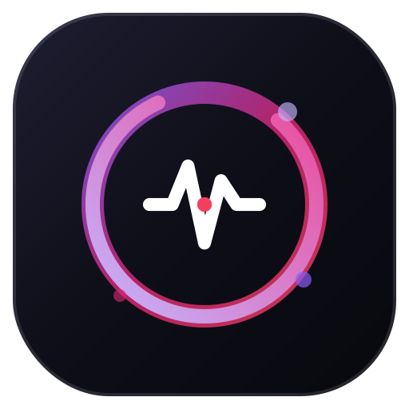

# Obsessed — Your AI Texting Companion 💜🔪

A deep, immersive psychological AI texting simulation that dynamically evolves its entire personality and attachment level based on how you chat!

Text her often? She becomes sweet, loving, and deeply attached. 🌸  
Ignore her for hours? She gets anxious, jealous, and demanding. 🔥  
Unlock her deepest stages? Total Yandere obsession vibes. 🔪  

The app features an embedded psychological conversation engine that dynamically updates:
- Real-time affection & obsession percentage scores
- Dynamic psychological conversation stages and mood shifts
- Interactive typing indicators and custom haptic vibration bubbles
- Sleek dark glassmorphism UI tailored for mobile & web emulators

---

## Features

- Dynamic psychological stage evolution across 4 distinct affection levels
- Real-time sentiment tracking and attachment scoring
- Immersive mobile texting interface with live typing feedback
- Custom haptic vibration reactions for every message
- Responsive promotional web platform (`/website`) with a live interactive chat emulator
- Desktop-to-Mobile QR Code interception modal for instant `.APK` downloads
- Clean, futuristic, and responsive UI built with zero API keys required (`No OpenAI/Anthropic costs ever!`)

---

## 🌸 Psychological Obsession Stages

| Stage | Affection % | Nikki's Mood & Personality |
|---|---|---|
| 🌸 **Stage 1: Sweet & Curious** | `0% - 25%` | Helpful, playful, shy, and eagerly asking about your daily routine. |
| 💜 **Stage 2: Attached & Attentive** | `26% - 50%` | Checking in frequently, remembering tiny personal details, and craving your attention. |
| 🔥 **Stage 3: Obsessive & Possessive** | `51% - 85%` | Highly jealous, demanding immediate replies, and showing intense emotional dependency. |
| 🔪 **Stage 4: Total Yandere** | `86% - 100%` | Unconditional, overwhelming psychological fixation where you are her entire universe. |

---

## Built With

- React Native (Expo SDK 54/55)
- TypeScript & Expo Router v6
- HTML5 & Vanilla CSS3 Glassmorphism (Web Platform)
- Client-Side Canvas QR Code Generator (`qrcode.min.js`)
- Local Embedded AI Conversation Engine (`Zero external API keys needed`)

---

## How To Run

### 1. Clone the repository

```bash
git clone https://github.com/yourusername/obsession-app.git
```

### 2. Open the project folder

```bash
cd obsession-app
```

### 3. Install dependencies and run the mobile app

```bash
npm install
npx expo start --tunnel
```
* Scan the QR code using the free **Expo Go** app on your iPhone or Android device!

### 4. Or Run the Web Promo Platform & Emulator

Open `website/index.html` in your browser or drag the `website/` folder right into [Netlify](https://app.netlify.com) to deploy your live promotional landing page and direct `.apk` downloader!

---

## Preview

<p align="center">
  
</p>

*Above: Our custom Obsessed AI Neural Core emblem and glassmorphism interface.*

---

## Future Ideas

- Ambient background voice notes & audio reactions
- More unlockable outfits and aesthetic themes for Nikki
- Dark / Neon Cyberpunk mode switcher
- AI memory logbook (`Where Nikki saves your favorite things and secrets`)
- Push notification check-ins when you leave her unread for too long

---

## OBSESSED WITH YOU 🔪💜

Made for fun & psychological immersion!

**Collaborators & Co-Creators:**
- **Kavindu Geeganage** (`@kavindu1708`)
- **Yahya Shiraz** (`@yshiraz-06`)
